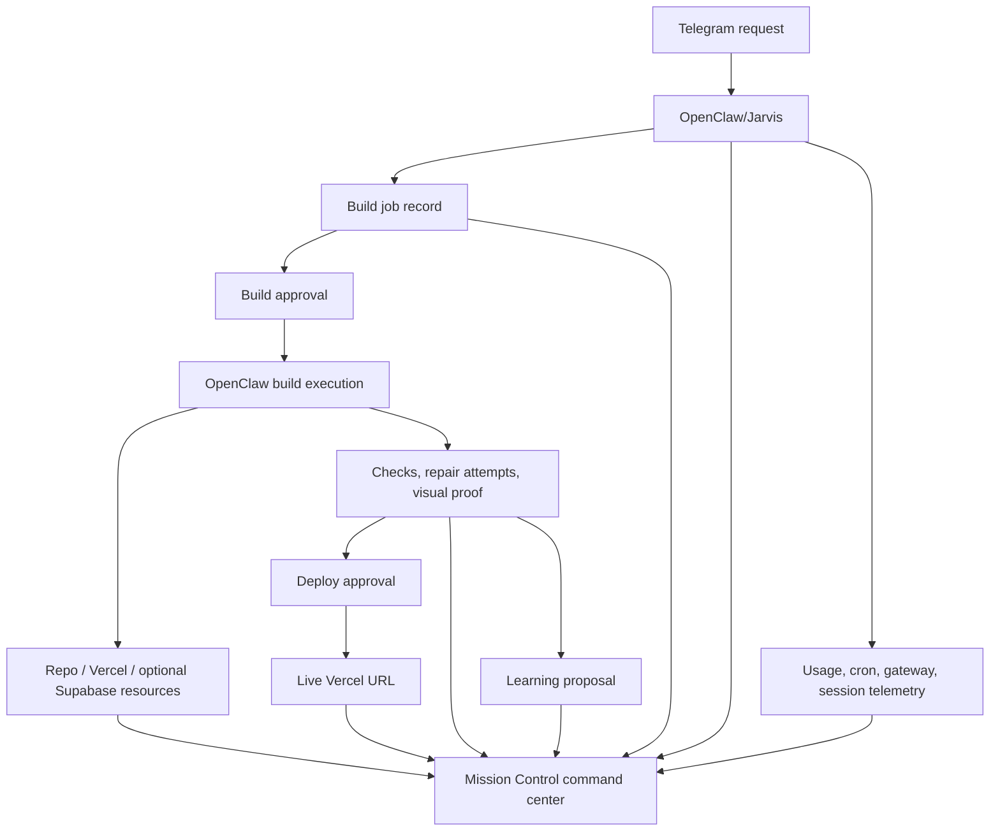

# feat: Build Jarvis App Factory Control Plane

## Summary

Implement the App Factory as a governed control plane inside Mission Control: formalize build jobs, approvals, app resources, deployments, repair attempts, learning proposals, OpenClaw telemetry, and usage estimates before wiring execution. Delivery should phase from data/workflow foundation to Jarvis operator UI, then Telegram/OpenClaw command routing, then the static-app vertical slice, and finally Supabase-backed app automation.

---

## Problem Frame

The current repo proves the first read-only loop from local OpenClaw state to Supabase to Mission Control and public Vercel apps. The next implementation needs a durable workflow contract so OpenClaw can safely create private repos, provision app infrastructure, deploy previews, ask for approvals, and report final URLs without becoming an untracked sequence of powerful side effects.

---

## Requirements

- R1. Preserve Telegram-first build creation, with Mission Control as a visibility and control surface rather than the primary intake surface.
- R2. Represent compact Telegram build proposals and detailed Mission Control job histories from the same source of truth.
- R3. Support two approval gates: build approval and production deploy approval.
- R4. Gate risky, billable, irreversible, public-data, and externally side-effecting work with explicit approval records.
- R5. Track separate private GitHub repo, Vercel project/deployments, and optional per-app Supabase project resources.
- R6. Support premium template selection and generated-app quality evidence before production.
- R7. Record preview URL, visual proof, build summary, checks, risks, and production target before deploy approval.
- R8. Preserve OpenClaw as the execution authority; Mission Control actions must route commands to OpenClaw instead of directly mutating workflow state.
- R9. Track surgical repair attempts, their outcomes, and the five-attempt-per-stage limit.
- R10. Track learning proposals for OpenClaw memory and long-term troubleshooting docs without writing learnings before Trevor approval.
- R11. Redesign Mission Control as a premium Jarvis-style command center covering both app factory and broader OpenClaw health.
- R12. Surface OpenClaw gateway, cron, model, session, token usage, and burn-rate estimates from local observations.
- R13. Keep raw secrets out of Mission Control storage; store only secret metadata and external placement.
- R14. Plan for future builder/reviewer/deployer/repair/learning workers without requiring them for MVP.
- R15. Define the data model and workflow specification before implementing Telegram/OpenClaw execution.
- R16. Keep the backend foundation clean, organized, and tree-shaped so outside engineers can understand where each addition attaches.
- R17. Prefer surgical additions and fixes over broad overhauls unless Trevor approves a larger redesign.

**Origin actors:** A1 Trevor, A2 OpenClaw/Jarvis, A3 Mission Control, A4 Generated app user, A5 External platforms.
**Origin flows:** Telegram build request, approved build to preview, preview approval to live URL, failure repair and learning proposal, Mission Control overview.
**Origin acceptance examples:** vague Telegram request clarification, Supabase provisioning approval, preview approval evidence, surgical repair loop, learning proposal approval, Mission Control OpenClaw telemetry home screen.

---

## Scope Boundaries

- Custom domains remain out of scope for MVP; generated apps use Vercel URLs.
- Generated-app pull requests remain out of scope for MVP; builds commit directly to `main`.
- Mission Control job creation remains out of scope for MVP; job creation starts in Telegram.
- Mission Control must not become a raw shell or a separate autonomous executor.
- Exact billing integration remains out of scope; usage and burn-rate are estimated unless OpenClaw exposes exact usage locally.
- Template code should live in curated template repos later; this repo should hold the template catalog, policies, and selection metadata for the control plane.
- Supabase-backed app automation should follow the static-app vertical slice, not block proving the safer static path.

### Deferred to Follow-Up Work

- Revisit the Mission Control Jarvis particle/interface treatment after the particle-only Desktop configurator is approved; keep current live UI functional while the exact particle layout is tuned separately.
- Build and harden the full external template repository library after the control-plane catalog and static vertical slice are stable.
- Add PR-based generated-app review for larger or client-sensitive apps after direct-to-main MVP is proven.
- Add custom-domain workflows after Vercel URL deployment, approval, and rollback behavior are reliable.
- Add encrypted secret vaulting only if future requirements need reusable secrets inside Mission Control.

---

## Context & Research

### Relevant Code and Patterns

- `supabase/migrations/20260516000100_foundation_v01.sql` defines the current v0.1 tables, enums, RLS policies, and public read policies.
- `supabase/migrations/20260517000100_data_api_grants.sql` grants browser-safe public reads and service-role writes for the current foundation tables.
- `scripts/collect-openclaw.mjs` already collects gateway status, cron jobs, watched files, and writes sanitized snapshots/events through Supabase REST.
- `apps/mission-control/app/page.tsx` is a server-rendered Next page that reads Supabase through server-side service-role access and displays apps, deployments, cron jobs, watched files, snapshots, and alerts.
- `apps/mission-control/middleware.ts` provides Basic Auth for the private dashboard.
- `apps/status-demo/app/page.tsx` proves public Vercel app access through anon Supabase reads constrained by RLS.
- OpenClaw workspace memory rules define `MEMORY.md` as durable operating rules, `memory/YYYY-MM-DD.md` as raw daily history, and `open-loops.md` as active commitments.
- OpenClaw session JSONL files already contain model usage fields with input/output/cache token counts, and trajectory files contain session/model metadata suitable for local usage estimates.

### Institutional Learnings

- No repo-local `docs/solutions/` directory exists yet.
- OpenClaw memory hygiene rules require durable memory to stay compact and history/details to move into daily memory or reference docs.
- Existing OpenClaw operating rules require dry-run plans plus confirmation for writes and explicit confirmation for destructive or irreversible external actions.

### External References

- Vercel `vercel promote` docs state that preview deployments can be promoted, but promoting a preview asks for confirmation and results in a new production deployment.
- Vercel preview-to-production docs state that promotion uses the same source code but performs a production build with production environment variables; the plan must verify source and environment assumptions before treating a preview as approved for live traffic.
- GitHub REST docs support creating and managing public and private repositories, including creating a repository from a template.
- Supabase Management API docs expose project creation through authenticated management API calls, which should be treated as a risky, approval-gated action.

---

## Key Technical Decisions

- Use Supabase as the workflow system of record: The current foundation already stores apps, deployments, snapshots, alerts, events, and audit logs; app-factory tables should extend that model instead of adding a second store.
- Keep OpenClaw command authority separate from Mission Control state: Mission Control may create command requests or invoke OpenClaw commands, but OpenClaw should own execution and write authoritative state transitions.
- Model jobs as both status and event history: dashboards need compact states, while debugging and audit need durable step-level timelines.
- Treat approvals as explicit records, not booleans: approval context, risk category, actor, channel, and decision are needed for security and post-run audit.
- Treat Vercel promotion as "approved source promoted with production env verification": Current Vercel behavior can rebuild with production env vars, so the plan should not promise byte-identical preview artifacts.
- Use local observed usage for token estimates: OpenClaw's session and trajectory records provide model and token data; cost-equivalent estimates should be labeled estimated.
- Store secret metadata only: Mission Control can track auth enabled, secret names, provider placement, and timestamps, but raw credentials stay in Telegram/Vercel/Supabase/local stores.
- Make template selection catalog-driven: App Factory needs curated metadata in the control plane before it can reliably choose external template repos.

---

## Open Questions

### Resolved During Planning

- Preview promotion semantics: Current Vercel docs require planning for source/env verification because preview promotion may create a production build using production env vars.
- Usage estimate source: OpenClaw local session JSONL and trajectory files expose token and model data, so MVP should aggregate local observed usage before adding provider billing integrations.
- Learning storage policy: OpenClaw memory rules make `MEMORY.md` durable and compact, daily memory historical, and reference docs suitable for detailed playbooks; approved learnings should respect that split.

### Deferred to Implementation

- Exact command shape for Mission Control-to-OpenClaw actions: The implementing agent should discover the safest current OpenClaw command/router interface and avoid introducing a second executor.
- Exact Supabase project provisioning mechanism: The implementing agent should validate Management API permissions and CLI support before automating project creation.
- Exact visual proof transport into Telegram: The implementing agent should verify whether OpenClaw can send screenshots/video files directly or must send links to stored artifacts.
- Exact token-cost formula: The implementing agent should derive estimates from available OpenClaw data and clearly mark unknown pricing assumptions.
- Frontend test runner choice: The repo currently has typecheck/build scripts but no established component test runner, so the implementing agent should add the smallest test setup that supports the planned view-model/action tests.

---

## High-Level Technical Design

> *This illustrates the intended approach and is directional guidance for review, not implementation specification. The implementing agent should treat it as context, not code to reproduce.*

State model should separate:

- **Job status:** one compact state for dashboards and Telegram summaries.
- **Step events:** append-only timeline for detailed audit and debugging.
- **Approvals:** explicit decisions attached to a job, step, risk, or deploy target.
- **Resources:** external repo/Vercel/Supabase/auth/artifact references linked to apps and jobs.
- **Command requests:** Mission Control-originated actions routed back to OpenClaw.
- **Command acknowledgement:** pending Mission Control requests must stay visibly pending until OpenClaw acknowledges, rejects, or completes them.

---

## Phased Delivery

- Phase 1: Workflow contract and Supabase schema for jobs, approvals, resources, steps, repair attempts, learning proposals, command requests, artifacts, and usage observations.
- Phase 2: Mission Control read layer and Jarvis-style home dashboard for existing telemetry plus new job/app factory state.
- Phase 3: Mission Control drill-down views for approvals, job timeline, app registry, deployments, repair history, and learning proposals.
- Phase 4: OpenClaw command/collector integration for writing job state, recording usage, and routing Mission Control commands back to OpenClaw.
- Phase 5: Static-app vertical slice through Telegram request, build approval, private repo, template selection, preview proof, deploy approval, and final Vercel URL.
- Phase 6: Supabase-backed app provisioning behind explicit approval gates.

---

## Implementation Units

### U1. Workflow Specification And Data Model

**Goal:** Define the App Factory workflow contract, state machine, approval model, resource model, telemetry/learning concepts, and backend foundation rules before implementing runtime behavior.

**Requirements:** R1, R2, R3, R4, R5, R8, R9, R10, R13, R14, R15, R16, R17

**Dependencies:** None

**Files:**
- Create: `docs/APP_FACTORY_WORKFLOW.md`
- Modify: `docs/ARCHITECTURE.md`
- Modify: `docs/DATA_MODEL.md`
- Modify: `docs/SECURITY_MODEL.md`
- Modify: `docs/SECURITY_OPERATIONS.md`
- Test: none

**Approach:**
- Document job statuses, approval gates, risk categories, command authority, resource types, artifact types, repair-attempt lifecycle, learning-proposal lifecycle, and telemetry sources.
- Make the OpenClaw authority boundary explicit: Mission Control displays and may request actions, but OpenClaw executes and records state transitions.
- Define how compact Telegram summaries map to detailed Mission Control records.
- Define the backend tree shape so future additions attach to request, approval, execution, resource/proof, deployment, or learning branches instead of creating duplicate systems.
- Include the Vercel preview-promotion caveat so production approval means "approved source and target verified," not guaranteed byte-identical artifact.

**Patterns to follow:**
- Existing concise docs in `docs/ARCHITECTURE.md`, `docs/DATA_MODEL.md`, `docs/SECURITY_MODEL.md`, and `docs/SECURITY_OPERATIONS.md`.
- Origin requirements in `docs/brainstorms/mission-control-app-factory-requirements.md`.

**Test scenarios:**
- Test expectation: none -- this unit creates planning/specification docs only.

**Verification:**
- The docs clearly answer what states exist, who may transition them, what requires approval, what Mission Control can do, and what remains deferred.
- The docs make the backend foundation inspectable by an outside engineer and discourage disconnected parallel systems.
- A later implementer can design migrations and UI without inventing workflow behavior.

---

### U2. Supabase Schema For App Factory State

**Goal:** Extend the Supabase foundation to persist build jobs, approvals, step events, command requests, external resources, visual proof artifacts, repair attempts, learning proposals, and usage observations.

**Requirements:** R2, R3, R4, R5, R7, R8, R9, R10, R12, R13, R14

**Dependencies:** U1

**Files:**
- Create: `supabase/migrations/20260518000100_app_factory_workflow.sql`
- Modify: `docs/DATA_MODEL.md`
- Modify: `docs/SECURITY_MODEL.md`
- Modify: `docs/SECURITY_OPERATIONS.md`
- Test: `supabase/seed.sql`

**Approach:**
- Add normalized workflow tables rather than overloading existing `events` and `audit_log`.
- Link generated apps to existing `apps` and `deployments` while adding app-factory-specific resource records for GitHub, Vercel, Supabase, auth, and proof artifacts.
- Keep new tables attached to the workflow tree and avoid duplicate approval, resource, or event stores.
- Keep RLS enabled and default browser access closed; Mission Control server-side reads through service-role remain the private dashboard path.
- Store secret metadata only: provider, secret name/key, environment, status, and timestamps, never secret values.
- Add seed rows only for safe demo/operator states that do not imply real external resources.

**Patterns to follow:**
- Existing migration style in `supabase/migrations/20260516000100_foundation_v01.sql`.
- Existing service-role grants in `supabase/migrations/20260517000100_data_api_grants.sql`.
- Current app/deployment seed pattern in `supabase/seed.sql`.

**Test scenarios:**
- Integration: applying migrations creates all workflow tables with RLS enabled and no anon read access to private workflow data.
- Integration: service-role can insert and read a build job, approval, step event, artifact metadata, repair attempt, learning proposal, and usage observation.
- Edge case: app resource records can represent static apps with no Supabase project and data-backed apps with an app-specific Supabase project.
- Error path: raw secret values are not represented by any seed data or expected schema field.

**Verification:**
- Supabase schema supports the workflow contract from U1.
- Public anon access remains limited to intended public app/status data.

---

### U3. OpenClaw Collector And Usage Observation Expansion

**Goal:** Expand local collection so Mission Control can display broader OpenClaw health, cron/model/session status, and estimated token usage/burn-rate signals.

**Requirements:** R11, R12

**Dependencies:** U2

**Files:**
- Modify: `scripts/collect-openclaw.mjs`
- Modify: `docs/ARCHITECTURE.md`
- Modify: `docs/DATA_MODEL.md`
- Test: `scripts/collect-openclaw.mjs`

**Approach:**
- Extend the collector around existing safe allowlisted reads rather than introducing arbitrary log upload.
- Parse local session and trajectory records for model, provider, token usage, cache usage, session type, and timestamps where available.
- Add summary rows suitable for daily awareness and per-job/session detail where job correlation exists.
- Keep cost-equivalent output explicitly estimated and preserve raw local evidence enough to debug the estimate without exposing sensitive prompt content.

**Patterns to follow:**
- Current `scripts/collect-openclaw.mjs` allowlist and sanitized summary approach.
- OpenClaw memory guidance that raw history belongs in daily/session records, while Mission Control should store operational summaries.

**Test scenarios:**
- Happy path: dry-run output includes gateway, cron, watched file metadata, and usage summary when local session records contain token usage.
- Edge case: sessions with zero usage, missing usage, or tool-only messages do not break collection.
- Error path: unreadable session files are reported as source warnings and do not fail the whole collector.
- Security: collected usage summaries do not include raw prompts, message bodies, credentials, or full logs.

**Verification:**
- Dry-run output is deterministic enough for review and does not expose raw private content.
- Supabase writes preserve existing collector behavior while adding usage observations.

---

### U4. Mission Control Data Access And View Models

**Goal:** Create a clean server-side read layer for Mission Control so the Jarvis UI can consume app factory, deployment, telemetry, usage, approval, and learning state without embedding query complexity in page components.

**Requirements:** R2, R5, R7, R8, R10, R11, R12, R13

**Dependencies:** U2, U3

**Files:**
- Create: `apps/mission-control/lib/supabase.ts`
- Create: `apps/mission-control/lib/mission-control-data.ts`
- Create: `apps/mission-control/lib/format.ts`
- Modify: `apps/mission-control/app/page.tsx`
- Test: `apps/mission-control/lib/mission-control-data.test.ts`

**Approach:**
- Move Supabase fetch logic out of `app/page.tsx` into a reusable server-only data layer.
- Return dashboard-ready view models for home overview, jobs, approvals, apps, deployments, OpenClaw telemetry, usage estimates, repair history, and learning proposals.
- Keep failure behavior graceful: missing env vars or failed reads should produce empty/unknown states, not crash the private dashboard.
- Preserve service-role use only in server-side code.

**Patterns to follow:**
- Existing server-side Supabase REST access in `apps/mission-control/app/page.tsx`.
- Existing Basic Auth boundary in `apps/mission-control/middleware.ts`.

**Test scenarios:**
- Happy path: view-model builders convert Supabase rows into home dashboard metrics and lists.
- Edge case: empty database returns zero/unknown states with no thrown errors.
- Error path: failed Supabase reads are isolated to affected sections and logged without exposing secrets.
- Security: view models omit raw secret values even when secret metadata rows exist.

**Verification:**
- `app/page.tsx` no longer owns raw query details.
- The same data layer can support home and drill-down pages without duplicating query logic.

---

### U5. Premium Jarvis Home Dashboard

**Goal:** Redesign Mission Control's first screen into a premium Jarvis-style operator console that summarizes OpenClaw health and App Factory operations.

**Requirements:** R6, R7, R11, R12

**Dependencies:** U4

**Files:**
- Modify: `apps/mission-control/app/page.tsx`
- Modify: `apps/mission-control/app/globals.css`
- Modify: `apps/mission-control/app/layout.tsx`
- Test: `apps/mission-control/app/page.test.tsx`

**Approach:**
- Replace the current plain dashboard with a high-density Jarvis command-center home screen.
- Prioritize urgent action at the top: pending approvals, active builds, failed/blocked jobs, and risky permission gates.
- Include portfolio and operations sections: live apps, recent deployments, OpenClaw gateway/model/cron status, estimated usage/burn rate, repair loops, and learning proposals.
- Use cinematic HUD styling carefully: strong identity, responsive layout, clear scanability, and no copyrighted movie assets or logos.
- Keep action buttons wired to inert or command-request paths until U6; do not introduce direct executor behavior.

**Patterns to follow:**
- Frontend guidance in this session: dense operator tool, no landing page, no card-within-card nesting, stable dimensions, responsive text, no cheap generic admin feel.
- Existing V4 Desktop handoff visual direction as inspiration only, not as a code port.

**Test scenarios:**
- Happy path: dashboard renders pending approvals, active jobs, apps, deployments, usage estimates, and OpenClaw telemetry from view models.
- Edge case: dashboard renders coherent empty states when no jobs or apps exist.
- Edge case: long app names, repo names, and URLs do not overlap or break layout on mobile.
- Accessibility: status, approval, and risk states are text-readable and not color-only.
- Visual: desktop and mobile screenshots show non-overlapping Jarvis-style layout with primary urgent actions visible.

**Verification:**
- Mission Control opens to a balanced overview of urgent action, app portfolio, and OpenClaw health.
- The UI matches the premium Jarvis operator-console direction while remaining usable.

---

### U6. Drill-Down Views And OpenClaw Command Requests

**Goal:** Add Mission Control drill-down surfaces for jobs, approvals, apps, deployments, repair attempts, and learning proposals, with controls that route requests to OpenClaw instead of mutating workflow state directly.

**Requirements:** R2, R3, R4, R5, R8, R9, R10, R13, R14

**Dependencies:** U4, U5

**Files:**
- Create: `apps/mission-control/app/jobs/[id]/page.tsx`
- Create: `apps/mission-control/app/apps/[id]/page.tsx`
- Create: `apps/mission-control/app/approvals/page.tsx`
- Create: `apps/mission-control/app/learnings/page.tsx`
- Create: `apps/mission-control/app/actions.ts`
- Modify: `apps/mission-control/lib/mission-control-data.ts`
- Test: `apps/mission-control/app/actions.test.ts`
- Test: `apps/mission-control/lib/mission-control-data.test.ts`

**Approach:**
- Build detailed timelines from job step events, approvals, artifacts, resource links, repair attempts, and learning proposals.
- Add approve/reject/cancel/retry/learning-review controls as command requests routed to OpenClaw, not direct state transitions.
- Record the intent and context needed for OpenClaw to act, including actor label, target job/resource, requested action, and risk scope.
- Keep controls disabled or clearly blocked when OpenClaw command routing is unavailable.
- Show command requests as pending until OpenClaw acknowledges or rejects them, so the UI does not imply an approval/cancel/retry already happened.

**Patterns to follow:**
- Origin decision that Mission Control is a control surface, not a separate executor.
- Existing server action conventions in Next if available in the repo's Next version; otherwise use server-only routes consistent with Next 16.

**Test scenarios:**
- Happy path: job detail shows compact status plus full timeline, approvals, resources, preview proof, deploy target, and repair history.
- Happy path: approval action creates a command request for OpenClaw with target context and does not directly mark the job approved.
- Happy path: after a Mission Control action is submitted, the UI shows a pending command state until OpenClaw acknowledgement changes it.
- Edge case: unknown job/app IDs render a safe not-found state.
- Error path: command request write failure surfaces an actionable UI error without changing local workflow state.
- Error path: rejected or stale command requests remain visible with the reason and next available action.
- Security: command actions require Mission Control auth and never accept raw shell commands from the browser.

**Verification:**
- Trevor can inspect and manage jobs from Mission Control while OpenClaw remains the authority that executes the requested action.

---

### U7. Template Catalog And Quality Gate Definition

**Goal:** Define the curated template catalog, template selection rules, generated-app quality gates, and visual proof expectations needed before static app generation starts.

**Requirements:** R6, R7, R13, R14

**Dependencies:** U1

**Files:**
- Create: `docs/TEMPLATE_CATALOG.md`
- Create: `docs/QUALITY_GATES.md`
- Create: `docs/TROUBLESHOOTING_PLAYBOOK.md`
- Modify: `docs/SECURITY_OPERATIONS.md`
- Test: none

**Approach:**
- Document the first three premium template types: polished site/app, dashboard/operator console, and Supabase CRUD app.
- Define required template metadata: intended use, access modes, data needs, env vars, quality checks, known limitations, screenshot/demo expectations, and customization guidance.
- Define generated-app quality gates at the product level: build/typecheck/lint where available, responsive visual proof, secret scan posture, approved access mode, risk review, preview evidence, and production target verification.
- Create the troubleshooting playbook target that approved learnings can update later.

**Patterns to follow:**
- Requirements doc's premium template base plus custom build decision.
- OpenClaw memory rules: durable operational guidance belongs in docs/reference material, not as noisy history in `MEMORY.md`.

**Test scenarios:**
- Test expectation: none -- this unit creates planning and operating docs only.

**Verification:**
- OpenClaw has a clear catalog to choose from before creating generated apps.
- Quality gates are explicit enough for later automation and review.

---

### U8. OpenClaw Telegram Vertical Slice Contract

**Goal:** Define and implement the first narrow OpenClaw/App Factory command contract for static apps: Telegram request, compact job proposal, build approval, milestone updates, preview proof, deploy approval, and final URL record.

**Requirements:** R1, R2, R3, R4, R5, R6, R7, R8, R14

**Dependencies:** U2, U6, U7

**Files:**
- Create: `docs/OPENCLAW_APP_FACTORY_COMMANDS.md`
- Create: `scripts/app-factory-job.mjs`
- Create: `scripts/app-factory-state.mjs`
- Modify: `package.json`
- Test: `scripts/app-factory-job.test.mjs`
- Test: `scripts/app-factory-state.test.mjs`

**Approach:**
- Start with a local command/state helper that OpenClaw can call from Telegram flows without giving Telegram raw shell access.
- Support structured job creation, approval recording, milestone recording, artifact/resource recording, command-request polling/acknowledgement, and final URL recording.
- Keep the first execution path static-app-only; data-backed app jobs can be represented but should pause before Supabase provisioning until U10.
- Make output suitable for Telegram's compact milestone style and Mission Control's detailed history.

**Patterns to follow:**
- `scripts/collect-openclaw.mjs` for Supabase REST helpers, dry-run behavior, and careful allowlisting.
- OpenClaw workspace command-router pattern: write plans/commands are structured and confirmation-gated, not raw arbitrary shell.

**Test scenarios:**
- Happy path: command helper creates a structured static-app job and records build/deploy approvals.
- Happy path: milestone output can produce compact Telegram-ready summaries and detailed Mission Control events from the same state.
- Edge case: duplicate approval attempts are idempotent or clearly rejected.
- Error path: missing Supabase credentials produces dry-run or blocked behavior instead of partial writes.
- Security: helper refuses unsupported arbitrary commands and stores no raw secrets.

**Verification:**
- OpenClaw has a safe narrow interface for the first Telegram-driven static-app workflow.

---

### U9. Static Generated-App Build And Deployment Slice

**Goal:** Prove the first end-to-end static app build path through private GitHub repo creation, template selection, Vercel preview, visual proof, deploy approval, promotion, and Telegram final URL.

**Requirements:** R1, R3, R4, R5, R6, R7, R8, R9, R13, R14

**Dependencies:** U7, U8

**Files:**
- Create: `docs/STATIC_APP_VERTICAL_SLICE.md`
- Create: `scripts/app-factory-static-build.mjs`
- Create: `scripts/app-factory-visual-proof.mjs`
- Create: `scripts/app-factory-vercel.mjs`
- Modify: `docs/SECURITY_OPERATIONS.md`
- Test: `scripts/app-factory-static-build.test.mjs`
- Test: `scripts/app-factory-vercel.test.mjs`

**Approach:**
- Use curated template metadata to create a private generated-app repo under `JarvisBot-knox`.
- Commit directly to `main` for MVP.
- Deploy a public preview URL, capture visual proof, and record all repo/deployment/artifact metadata.
- Before production, verify the reviewed preview's source and intended production environment assumptions.
- Promote through Vercel when possible and record final production URL plus verification results.

**Patterns to follow:**
- Existing Vercel-linked app docs and deployment records.
- GitHub template repo and private repo creation patterns from official GitHub REST docs.
- Vercel preview promotion docs, especially the production rebuild/env-var caveat.

**Test scenarios:**
- Happy path: a dry-run static build records intended repo, template, preview, proof, deploy approval, and final URL metadata without creating external resources.
- Integration: real execution creates a private repo and Vercel preview only after build approval.
- Integration: production deploy action is blocked until deploy approval exists.
- Error path: GitHub or Vercel failure records a failed step and does not advance the job to preview/live.
- Error path: Vercel promotion mismatch or missing verification pauses the job instead of claiming live success.
- Security: generated repo defaults to private and no raw Basic Auth or platform secret values are written to app-factory records.

**Verification:**
- One static app can travel from approved Telegram job to preview proof to approved live Vercel URL with Mission Control showing the full trail.

---

### U10. Supabase-Backed App Provisioning Gate

**Goal:** Add the data-backed path after the static slice: explicit database approval, separate Supabase project provisioning, app-specific migration tracking, env metadata, and Vercel binding records.

**Requirements:** R4, R5, R7, R8, R13, R14

**Dependencies:** U9

**Files:**
- Create: `docs/SUPABASE_APP_PROVISIONING.md`
- Create: `scripts/app-factory-supabase.mjs`
- Modify: `scripts/app-factory-job.mjs`
- Modify: `docs/SECURITY_OPERATIONS.md`
- Test: `scripts/app-factory-supabase.test.mjs`

**Approach:**
- Treat Supabase project creation as an explicit risky/billable approval gate.
- Track project metadata, migration status, anon/service key placement metadata, and Vercel env binding status without storing raw secret values.
- Start with generated migration/setup tracking and project creation, then let app-specific templates consume the resulting env placement.
- Require RLS/public-data review before any public table or public write path is enabled.

**Patterns to follow:**
- Supabase Management API project-creation docs.
- Current Supabase CLI/migration discipline in repo docs and scripts.
- Existing security model: service-role keys only in server/local/approved env stores.

**Test scenarios:**
- Happy path: a data-backed job pauses for database approval before project provisioning.
- Happy path: approved provisioning records project metadata, migration status, and env secret metadata without storing raw values.
- Edge case: static jobs do not create Supabase project records.
- Error path: failed Supabase project creation records a blocked/failed step and does not mark data infrastructure ready.
- Security: public RLS/public write exposure cannot be marked ready without an explicit approval record.

**Verification:**
- Data-backed app jobs can safely represent and provision per-app Supabase infrastructure after explicit approval.

---

## System-Wide Impact

- **Interaction graph:** Telegram and Mission Control become two control surfaces over one OpenClaw-executed workflow; Supabase stores workflow state and Mission Control renders it.
- **Error propagation:** External platform failures should become failed or blocked job steps, not uncaught dashboard errors or silent Telegram failures.
- **State lifecycle risks:** Jobs may pause between approvals, repairs, preview, deploy, and learning proposal; state transitions must be idempotent and auditable.
- **API surface parity:** Telegram and Mission Control must show consistent approval state, even though job creation starts only in Telegram.
- **Integration coverage:** The static vertical slice requires cross-layer verification across OpenClaw helper, Supabase state, GitHub repo metadata, Vercel deployment metadata, visual proof, and Mission Control display.
- **Unchanged invariants:** Public apps should still read only RLS-permitted public rows; Mission Control should remain Basic Auth protected; raw secrets should not enter browser code or app-factory database records.

---

## Risks & Dependencies

| Risk | Mitigation |
|------|------------|
| Mission Control becomes a second executor | Route actions as OpenClaw command requests and keep OpenClaw responsible for state transitions. |
| Mission Control action buttons imply completion before OpenClaw acts | Represent command requests as pending/acknowledged/rejected/completed instead of mutating job state directly. |
| Approval records drift from actual external actions | Record command request, OpenClaw acknowledgement, external resource metadata, and final step result as separate timeline events. |
| Vercel preview approval is mistaken for byte-identical production artifact | Verify source commit and production env assumptions before promotion; record any fresh build caveat in the deploy approval summary. |
| Supabase automation creates cost or exposure accidentally | Make project provisioning, public data, public writes, and auth/user-data flows explicit approval gates. |
| Token/burn-rate dashboard appears more exact than it is | Label usage as observed locally and cost as estimated unless exact billing data exists. |
| Premium UI becomes theatrical but less usable | Keep urgent actions and state readability first; use Jarvis visual identity without sacrificing density, accessibility, or mobile layout. |
| Learning proposals pollute memory | Require Trevor approval and route durable details to playbook/reference docs rather than stuffing history into `MEMORY.md`. |
| External template repos are not ready | Start with catalog and quality rules; prove static flow against one curated template path before expanding the library. |

---

## Documentation / Operational Notes

- Update existing docs as the source of truth evolves; do not let `docs/APP_FACTORY_WORKFLOW.md`, `docs/DATA_MODEL.md`, and migrations drift.
- Keep `docs/TROUBLESHOOTING_PLAYBOOK.md` as the long-term target for approved reusable fix guidance.
- Add rollback notes to deployment docs before treating App Factory deploys as reliable for client-sensitive apps.
- Preserve `.env`, `.vercel`, Supabase temp files, and any generated credentials as ignored/local-only materials.

---

## Alternative Approaches Considered

- Mission Control as executor: rejected because it creates split authority and risks bypassing OpenClaw's Telegram-first approval model.
- One monorepo for generated apps: rejected by product decision; generated apps should have separate private repos under `JarvisBot-knox`.
- Supabase shared project for all apps: rejected by product decision; data-backed apps should have separate Supabase projects.
- Full Supabase-backed automation before static slice: deferred because static app creation proves the safer repo/template/Vercel/approval loop first.

---

## Sources & References

- **Origin document:** [docs/brainstorms/mission-control-app-factory-requirements.md](../brainstorms/mission-control-app-factory-requirements.md)
- Related code: [scripts/collect-openclaw.mjs](../../scripts/collect-openclaw.mjs)
- Related code: [apps/mission-control/app/page.tsx](../../apps/mission-control/app/page.tsx)
- Related code: [apps/mission-control/middleware.ts](../../apps/mission-control/middleware.ts)
- Related code: [supabase/migrations/20260516000100_foundation_v01.sql](../../supabase/migrations/20260516000100_foundation_v01.sql)
- Related docs: [docs/ARCHITECTURE.md](../ARCHITECTURE.md)
- Related docs: [docs/DATA_MODEL.md](../DATA_MODEL.md)
- Related docs: [docs/SECURITY_MODEL.md](../SECURITY_MODEL.md)
- Related docs: [docs/SECURITY_OPERATIONS.md](../SECURITY_OPERATIONS.md)
- External docs: [Vercel CLI promote](https://vercel.com/docs/cli/promote)
- External docs: [Vercel promote preview to production](https://vercel.com/docs/deployments/promote-preview-to-production)
- External docs: [GitHub REST repositories](https://docs.github.com/en/rest/repos)
- External docs: [Supabase Management API create project](https://supabase.com/docs/reference/api/create-a-project)
